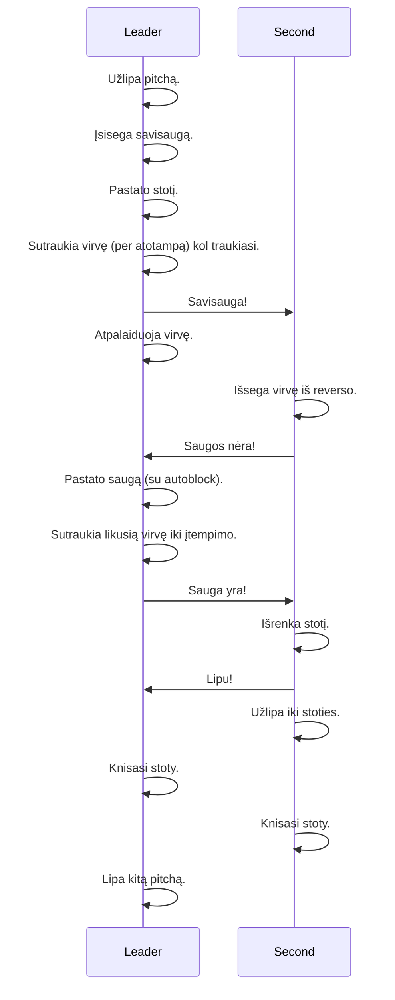

# Multipitch

## High level process

### Communication

| Verbal        | After         | Rope      |
| ------------- | ------------- | ---------- |
| Savisauga     | --            | 3 patraukimai, 5 sec, 3 patraukimai. |
| Saugos nėra   | Savisauga     | 3 patraukimai   |
| Sauga yra     | Saugos nėra   | 3 patraukimai   |
| Lipu          | Sauga yra     | 3 patraukimai    |

