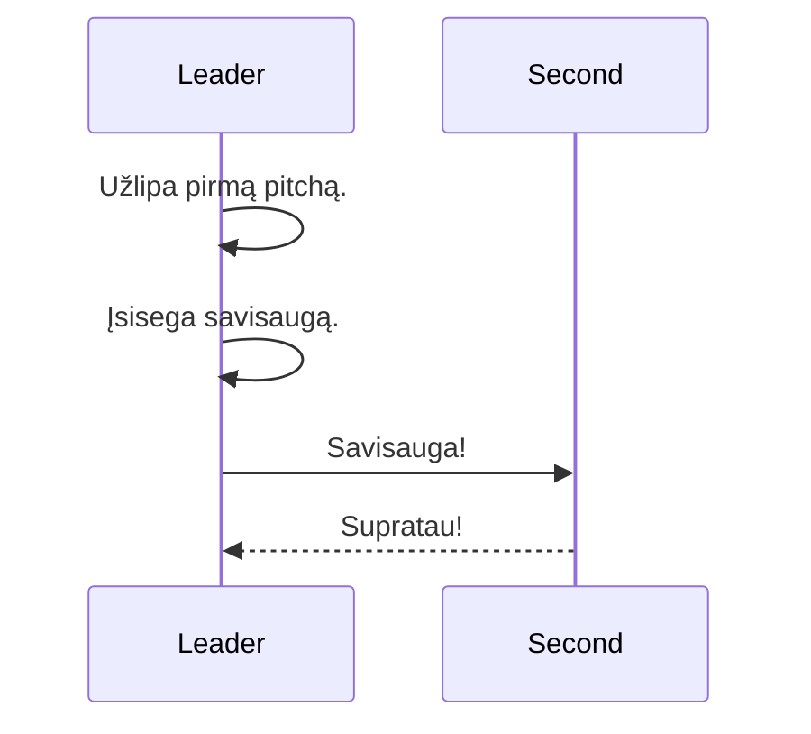

# Multipitch

## High level process

### Communication
| Verbal        | After         | Rope      |
| ------------- | ------------- | ---------- |
| Savisauga     | --            | 3 patraukimai, 5 sec, 3 patraukimai. |
| Supratau      | --            | ?            |
| Gali lipt     | Savisauga     | 3 patraukimai   |
| Lipu          | Gali lipt     | 3 patraukimai    |
