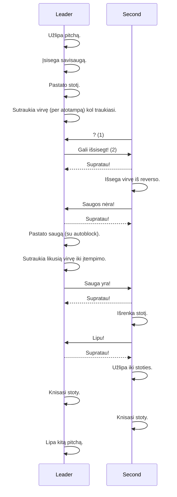

# Multipitch

## High level process

Process questions:
1) Angliškai: "That's me!" Kaip lietuviškai?
2) Ar "Savisauga!" ?

### Communication

| Verbal                    | After         | Rope      |
| -------------             | ------------- | ---------- |
| That's me                 | --            | ?            |
| Savisauga / Gali išsisegt | --            | 3 patraukimai, 5 sec, 3 patraukimai. (1) |
| Supratau                  | --            | ?            |
| Saugos nėra               | Savisauga     | ?            |
| Sauga yra                 | Saugos nėra   | 3 patraukimai   |
| Lipu                      | Sauga yra     | 3 patraukimai    |

Communication questions:
1) Kaip padaryt, kad jaustųsi patraukimai, jei virvėje slackas?

### General questions
1) Verbal + rope communication, or rope only?
