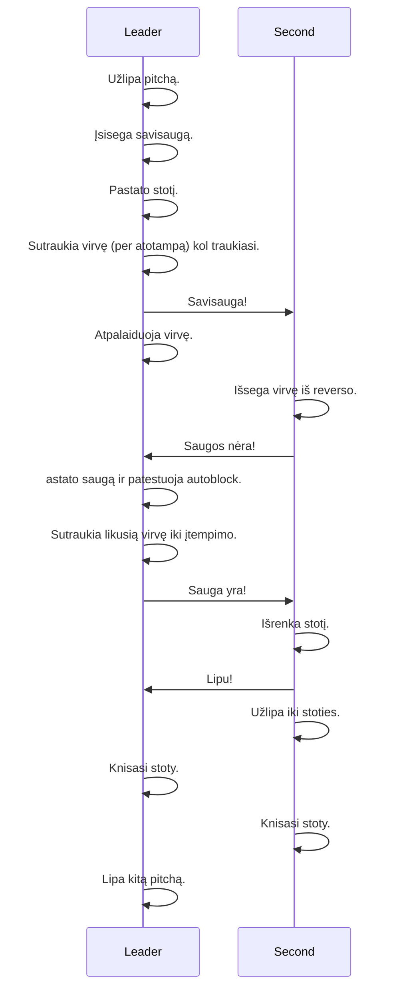

# Multipitch

## High level process

### Communication

Prieš kiekvieną virvės signalą, signalizuojantis įtempia virvę.
| Verbal        | After         | Rope      |
| ------------- | ------------- | ---------- |
| Savisauga     | --            | 3 patraukimai, 5 sec, 3 patraukimai. |
| Saugos nėra   | Savisauga     | 3 patraukimai   |
| Sauga yra     | Saugos nėra   | 3 patraukimai   |
| Lipu          | Sauga yra     | 3 patraukimai    |

## Stoties statymas
### Part I.
Užlipęs iki stoties boltų, leaderis:
1) Įsega paskutinę atotampą į stoties boltą toje pusėje, į kurią bus lipama toliau.
2) Įsega virvę į paskutinę atotampą.

### Jei nėra grandinių su žiedu
1) Įsega karabiną į kitą boltą, ir abi savisaugas į jį.
2) Įsega piemens mazgą į atotampą (for redundancy).
3) [Pastato stotį](https://www.wallrat.com/PDF_Files/Anchoring.pdf). Statant teks trumpam atidaryti karabiną, kuriame savisaugos, ir išsegti atotampą, kurioje piemens mazgas, bet viskas ok, nes abiem atvejais dar yra kitas taškas.

### Part II.
1) Įsega abi savisaugas į stoties žiedą.

## Saugos paruošimas saugoti atlipantį į stotį iš apačios
1) Jei atotampoje piemens mazgas, išriša jį.
2) Traukia virvę per atotampą (kad būtų lengviau).
3) Kai virvė baigiasi, signalizuoja "savisauga" ir atpalaiduoja virvę, kad apatinis galėtų išsisegti reversą.
4) Kai gauna signalą "saugos nėra", nusiima reversą nuo apraišų.
5) Įsega reversą į papildomą karabiną su autoblock, o tą karabiną į stoties karabiną.
6) Įsega virvę į reversą per reverso karabiną.
7) Patestuoja autoblock.
8) Signalizuoja "sauga yra".
